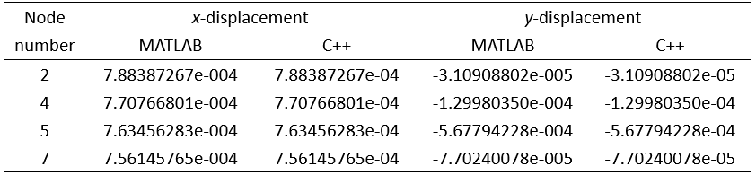
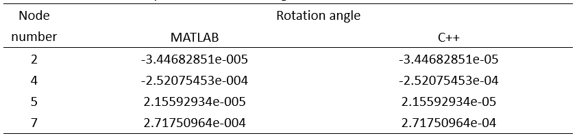
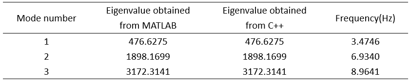
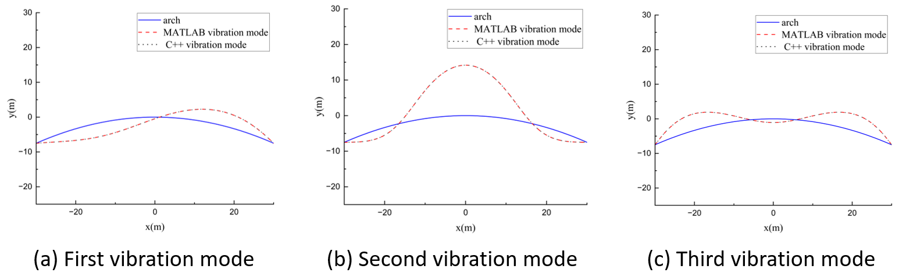

# Examples

# Table of contents

- [Example 1: Structural static analysis](#example-1:-structural-static-analysis)
- [Example 2: Structural dynamic analysis](#example-2:-structural-dynamic-analysis)
- [Reference](#reference)

## Example 1: Structural static analysis

​        Static analysis in finite element process can be summarized as a linear algebraic equation solving problem in the form of **Kδ** = **f**, where stiffness matrix **K** is a symmetric positive definite band matrix and the nodal displacement **δ** and the nodal force **f** are vectors. The linear algebraic equations can be solved by function solve declared in symmetric band matrix class. It assumes that users input symmetric band matrix **mA** and symmetric matrix **mC**, and returns the solution of **mAmB**=**mC**. Specially, when **mC** is a vector, the size of it becomes n×1. 

​        To create test data that meets the required condition, a finite element program is written by MATLAB to obtain finite element matrices. The obtained data is then imported into the test file `ZjuMatrixExampleOne.cpp` using `ifstream`, which successfully configured the `ZjuMatrix` static library, as a txt file. Taking a rigid frame subjected to distributed and concentrated forces as an example, calculate the displacement of each node. The distribution of forces and geometry properties of the rigid frame are shown in Fig. 1. Elastic modulus *E* is 210GPa, cross-sectional area of the rigid frame *A* is 1.0×10^-2^ m^2^ and bending moment of inertia *I* is 2.0×10^-4^m^4^. 

|                           |
| :----------------------------------------------------------: |
| **Fig. 1.** A rigid frame subjected to distributed and concentrated forces |

​        Finite element model of plane bar structure is defined using MATLAB. Finite element nodes and elements are defined according to the geometry properties of the rigid frame. Materials are defined referring to the given material properties. The first-type constraint condition is defined at the corresponding degree-of-freedom of the column’s bottom part. And according to the distribution of forces the rigid frame subjected to, concentrated and distributed forces are defined. In the process of solving the finite element model, local stiffness matrices and equivalent nodal force vectors are calculated first, followed by assembling them to a global stiffness matrix and a global equivalent nodal force vector. After that, method of large number is applied to satisfy the constraint condition, obtaining the global stiffness matrix **gK** and the global nodal force vector **f** after processing boundary condition. Expressed by scientific notation with 15 significant digits reserved, the data of band matrices and vectors are exported into txt files, and **gK** is stored by symmetric band matrix class after string processing in C++ program. Function solve defined in symmetric band matrix class is called to solve linear algebraic equations in the form of **Kδ**=**f**, the solution of *x*- and *y*-direction of displacement and rotation angle obtained from C++ program can match the ones obtained from MATLAB, as shown in Table 1 and Table 2. 

| Table 1. Comparison of x- and y-displacement solution between MATLAB and C++ |
| :----------------------------------------------------------: |
|                                     |

| Table 2. Comparison of rotation angle solution between MATLAB and C++ |
| :----------------------------------------------------------: |
|                                     |

​        This example illustrates that `ZjuMatrix` has the ability for data storage management of matrices and linear algebraic equation solving for symmetric band positive definite matrices, thus meeting the requirement of static finite element analysis well. 

 

## Example 2: Structural Dynamic Analysis

​        Dynamic analysis and buckling analysis in finite element process can be summarized as generalized eigenvalue problem in the form of **Kψ**=λ**Mψ**, where the stiffness matrix **K** is symmetric positive definite banded and the mass matrix **M** is symmetric positive definite banded or symmetric semi-positive definite banded. Solving eigenvalue problem is time-consuming and accounts for a large proportion in the entire solving process, especially when **M** and **K** have a large order. It not only causes problems of storage space, but also requires a large amount of work to calculate all the eigenvalues and corresponding eigenvectors. However, when it comes to problems in practice, only the first few modes of eigenvalues and their corresponding eigenvectors are required. The subspace iteration method provided by `ZjuMatrix` static library can effectively solve these problems. It can reduce dimension by Rayleigh-Ritz analysis method, and its essential idea is using approximation of eigenvectors to span a subspace approaching the *p*-dimensional least-dominant subspace *E*∞ , which is formed by **M**-orthonormal *p*-dimensional basis, through iteration. The effectiveness of this algorithm comes from the fact that it is easier to find a *p*-dimensional subspace close to *E*∞ than to find *p* vectors close to required eigenvectors, respectively[[1](https://asmedigitalcollection.asme.org/pressurevesseltech/article/106/4/421/436805/Finite-Element-Procedures-in-Engineering-Analysis)]. 

​         Subspace iteration method is implemented by function `subspaceIteration` declared in the head file of `ZjuMatrix`. This function assumes that users input a required modes nm, a tolerance dTol, a stiffness matrix **mK** and a mass matrix **mM** obtained from finite element analysis which addresses the constraint condition by eliminating whole rows and columns, where **mK** is symmetric positive definite banded and **mM** is symmetric positive definite banded or semi-positive definite banded. The prefixes n, d, and m represent the data type of int, double and matrix class, respectively. 

​        To create test data that meets the required condition, a finite element program is written by MATLAB to obtain finite element data. The obtained data is then imported into the test file `ZjuMatrixExampleTwo.cpp` using `ifstream`, which successfully configured the `ZjuMatrix` static library, as a txt file. Taking a two-hinged parabolic arch shown in Fig. 6 as an example, calculate the first three orders of frequency and free vibration modes. The arch has a span *L* of 60m and a rise *f* of 7.5m. The elastic modular *E* is 206GPa, cross-sectional area of the arch *A* is 0.0815m^2^, bending moment of inertia *I* is 0.03622m^4^, and linear density *ρ* is 1435.2kg/m. 

|              |
| :-------------------------------------: |
| **Fig. 2.** A two-hinged parabolic arch |

​        Plane bar structure finite element model is defined using MATLAB. The two-hinged parabolic arch is equally divided into 100 elements. According to geometry properties of the parabolic arch, finite element nodes and elements are defined. Materials are defined referring to the given material properties. The first-type constraint condition is defined at the corresponding degree-of-freedom of the two hinges. In the process of solving finite element model, the local stiffness matrices and mass matrices are calculated first, and then the assembly of them into a global stiffness matrix and a global mass matrix is carried out. After that, eliminating whole rows and columns which are corresponding to the degree-of freedom with a first-type constraint condition to satisfy the Dirichlet boundary condition. The dimension of the matrices is reduced and the stiffness matrix **gK** and the mass matrix **gM** after boundary condition processing are obtained. Expressed by scientific notation with 15 significant digits reserved, the data of band matrices and vectors are exported into txt files, and **gK** and **gM** are stored by symmetric band matrix class after string processing in C++ program. Function `subspaceIteration` defined in the head file of `ZjuMatrix` is called to solve generalized eigenvalue problem in the form of **gKψ=**λ**gMψ**, the solution of eigenvalues and corresponding eigenvectors obtained from C++ program can match the ones obtained from MATLAB, as shown in Table 3 and Fig. 3. 

| Table 3. Comparison of eigenvalue solutions between MATLAB and C++ |
| :----------------------------------------------------------: |
|                                     |

|                                       |
| :----------------------------------------------------------: |
| **Fig. 3.** Comparison of the first three modes between MATLAB and C++ |

​        This example illustrates that `ZjuMatrix` has the ability for data storage management, basic operations and computations of matrix, matrix factorizations, equation solving and generalized eigenvalue problem solving by means of generalized Jacobi method and subspace iteration method, thus becoming the underlying support for dynamics finite element analysis. 

## **Reference**

[1]   Bathe KJ. Finite Element Procedures in Engineering analysis. (1982). Englewood Cliffs, N.J: Prentice-Hall. 

